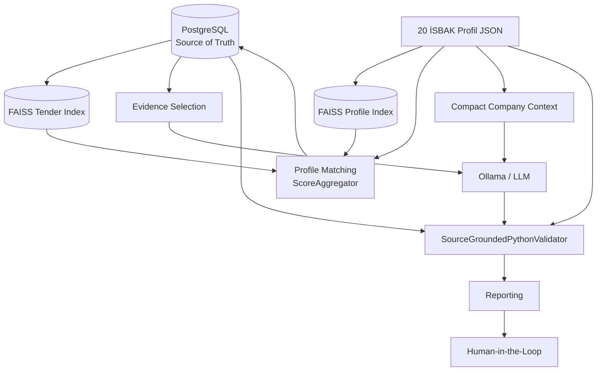
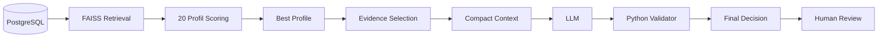

# EKAP–İSBAK İhale Karar Destek Sistemi — Teknik Mimari

> **Doküman amacı:** EKAP–İSBAK İhale Karar Destek Sistemi'nin güncel yazılım mimarisini, veri akışını, modül sorumluluklarını, karar zincirini, performans karakteristiklerini ve bileşen sınırlarını teknik olarak açıklamak.

---

## İçindekiler

- [1. Mimari Özet](#1-mimari-özet)
- [2. Temel Tasarım İlkeleri](#2-temel-tasarım-ilkeleri)
- [3. Üst Seviye Sistem Mimarisi](#3-üst-seviye-sistem-mimarisi)
- [4. Uçtan Uca Karar Akışı](#4-uçtan-uca-karar-akışı)
- [5. Katmanlı Mimari](#5-katmanlı-mimari)
- [6. PostgreSQL Katmanı](#6-postgresql-katmanı)
- [7. FAISS ve Vektör Katmanı](#7-faiss-ve-vektör-katmanı)
- [8. Profil Eşleştirme Katmanı](#8-profil-eşleştirme-katmanı)
- [9. Kanıt Seçimi ve Compact Context](#9-kanıt-seçimi-ve-compact-context)
- [10. LLM Karar Katmanı](#10-llm-karar-katmanı)
- [11. Python Doğrulama Katmanı](#11-python-doğrulama-katmanı)
- [12. Raporlama Katmanı](#12-raporlama-katmanı)
- [13. Performans Mimarisi](#13-performans-mimarisi)
- [14. Model Kıyaslama Mimarisi](#14-model-kıyaslama-mimarisi)
- [15. Hata ve Güvenlik Stratejileri](#15-hata-ve-güvenlik-stratejileri)
- [16. Proje Dizin Yapısı](#16-proje-dizin-yapısı)
- [17. Kritik Dosyalar](#17-kritik-dosyalar)
- [18. Veri Sözleşmeleri ve Karar Sınırları](#18-veri-sözleşmeleri-ve-karar-sınırları)
- [19. Bilinen Mimari Sınırlamalar](#19-bilinen-mimari-sınırlamalar)
- [20. Mimari Kararların Gerekçeleri](#20-mimari-kararların-gerekçeleri)

---

# 1. Mimari Özet

EKAP–İSBAK sistemi, klasik bir LLM uygulamasından farklı olarak **tek bir modele doğrudan karar verdirmeyen**, çok katmanlı ve kaynak kontrollü bir karar destek mimarisidir.

Sistemin temel bileşenleri:

```text
PostgreSQL
   │
   ├── Güncel ihale verisi
   │
   ▼
FAISS
   │
   ├── Anlamsal aday bulma
   │
   ▼
Profil Eşleştirme
   │
   ├── 20 İSBAK faaliyet profili
   │
   ▼
Kanıt Seçimi
   │
   ├── 1 / 3 / 4 chunk
   │
   ▼
Compact Context
   │
   ▼
LLM / Ollama
   │
   ├── Yapılandırılmış JSON karar taslağı
   │
   ▼
Python Validator
   │
   ├── Kaynak doğrulama
   │
   ├── Faaliyet kapsamı
   │
   ├── Negatif / pozitif kontrol
   │
   ▼
Nihai Karar
   │
   ├── uygun
   ├── uygun_degil
   └── inceleme_gerekli
```

Mimari üç temel sorumluluğu birbirinden ayırır:

| Sorumluluk | Bileşen |
|---|---|
| Gerçek veri | PostgreSQL |
| Hızlı anlamsal aday bulma | FAISS |
| Dilsel yorumlama | LLM |
| Deterministik kontrol | Python |
| Nihai operasyonel karar | İnsan |

---

# 2. Temel Tasarım İlkeleri

## 2.1 Source of Truth ayrımı

**PostgreSQL**, sistemin tek güncel veri kaynağıdır.

FAISS:

- karar kaynağı değildir,
- yalnızca retrieval (getirim) motorudur,
- eski snapshot içerebilir.

Bu nedenle LLM kararına girecek kritik ihale verisi gerektiğinde PostgreSQL üzerinden yeniden doğrulanır.

---

## 2.2 LLM tek başına karar vermez

LLM'in görevi:

- metni yorumlamak,
- ilişki kurmak,
- gerekçe üretmek,
- yapılandırılmış bir karar taslağı oluşturmaktır.

Python katmanının görevi:

- model kararını doğrulamak,
- kaynak ID'lerini kontrol etmek,
- faaliyet kapsamı kurallarını uygulamak,
- güven skorunu kalibre etmek,
- gerektiğinde kararı `inceleme_gerekli` seviyesine çekmektir.

---

## 2.3 CPU-only çalışma

Sistem mimarisi GPU zorunluluğu olmadan tasarlanmıştır.

```text
OLLAMA_NUM_GPU=0
```

Temel hedef:

> Minimum donanım, maksimum verim.

---

## 2.4 İnsan onayı zorunluluğu

Sistem:

```text
automatic_action_allowed = False
```

prensibiyle çalışır.

Yani hiçbir karar:

- otomatik teklif,
- otomatik başvuru,
- otomatik ihale dışlama,
- otomatik sözleşme

işlemine dönüşmez.

---

# 3. Üst Seviye Sistem Mimarisi



Bu mimaride veri, LLM'e doğrudan ve kontrolsüz biçimde gitmez.

---

# 4. Uçtan Uca Karar Akışı

Bir ihale için sistemin işlem sırası:

```text
[1] PostgreSQL'den aday ihale havuzu alınır
        │
        ▼
[2] İhale FAISS snapshot içinde aranır
        │
        ├── Yok → atla
        │
        └── Var
             │
             ▼
[3] İhaleye ait FAISS vektörleri çıkarılır
             │
             ▼
[4] 20 şirket profili ile karşılaştırılır
             │
             ▼
[5] Her profil için ScoreAggregator çalışır
             │
             ▼
[6] En iyi profil seçilir
             │
             ▼
[7] Güncel ihale verisi PostgreSQL'den doğrulanır
             │
             ▼
[8] Karar için gerekli evidence chunk'ları seçilir
             │
             ▼
[9] Profil compact context'e dönüştürülür
             │
             ▼
[10] LLM'e tek karar isteği gönderilir
             │
             ▼
[11] Strict JSON cevap alınır
             │
             ▼
[12] Python validator çalışır
             │
             ▼
[13] Güven skoru kalibre edilir
             │
             ▼
[14] Nihai karar oluşturulur
             │
             ▼
[15] CSV / JSONL / özet raporlara yazılır
```

---

# 5. Katmanlı Mimari

Sistem işlevsel olarak aşağıdaki katmanlara ayrılmıştır:

```text
┌─────────────────────────────────────────────┐
│               Reporting Layer               │
├─────────────────────────────────────────────┤
│          Python Validation Layer             │
├─────────────────────────────────────────────┤
│               LLM Decision Layer             │
├─────────────────────────────────────────────┤
│        Evidence / Context Preparation        │
├─────────────────────────────────────────────┤
│          Matching / Scoring Layer            │
├─────────────────────────────────────────────┤
│             Retrieval / FAISS                │
├─────────────────────────────────────────────┤
│              PostgreSQL Layer                │
└─────────────────────────────────────────────┘
```

Bu ayrım sayesinde:

- her katman bağımsız test edilebilir,
- performans ayrı ayrı ölçülebilir,
- LLM değiştirilebilir,
- retrieval motoru değiştirilebilir,
- iş kuralları modelden bağımsız kalabilir.

---

# 6. PostgreSQL Katmanı

## Rol

PostgreSQL:

- güncel ihale kayıtlarını saklar,
- aktif ihale havuzunu sağlar,
- LLM öncesi grounding (gerçekleme) kaynağıdır.

## Sistem içerisindeki yeri

```text
PostgreSQL
   │
   ├── active tenders
   ├── tender metadata
   ├── ihale başlığı
   ├── kapsam
   ├── ilan / açıklama
   ├── OKAS
   └── diğer karar alanları
```

## Neden FAISS'ten sonra tekrar okunuyor?

FAISS snapshot eski olabilir.

Bu nedenle:

```text
FAISS = aday bulma
PostgreSQL = karar kaynağı
```

ayrımı korunur.

---

# 7. FAISS ve Vektör Katmanı

## İhale indeksi

```text
storage/faiss/
```

İhale chunk vektörlerini saklar.

## Profil indeksi

```text
storage/faiss_profiles/
```

İSBAK faaliyet profili vektörlerini saklar.

## Embedding modeli

```text
BAAI/bge-m3
```

- embedding boyutu: 1024
- CPU üzerinde çalışır
- ihale ve profil semantik karşılaştırmasında kullanılır

## Vektör saklama yaklaşımı

FAISS:

```text
IndexIDMap
```

tabanlı yapı ile external ID ↔ internal vector ID ilişkisini korur.

---

# 8. Profil Eşleştirme Katmanı

Profil eşleştirme:

```text
app/matching/
```

katmanında yürütülür.

Ana sorumluluklar:

- ihale vektörlerini profil vektörleriyle karşılaştırmak,
- cosine / dot-product benzerlikleri hesaplamak,
- profil metadata'sını değerlendirmek,
- OKAS desteğini kontrol etmek,
- strong / supporting / negative term kurallarını değerlendirmek,
- nihai retrieval score üretmek.

## ScoreAggregator

Temel skor bileşenleri:

| Bileşen | Ağırlık |
|---|---:|
| Maksimum chunk benzerliği | %55 |
| Top mean benzerlik | %20 |
| Section diversity | %10 |
| OKAS desteği | %10 |
| Başlık desteği | %5 |

Negatif terim eşleşmeleri ayrıca ceza oluşturabilir.

> Retrieval score bir uygunluk olasılığı değildir.

---

## 8.1 Profile Runtime Cache

Profil skorlamasında tekrar eden ağır işlemler ihale döngüsü dışına taşınmıştır.

Önbelleğe alınan başlıca veriler:

```text
profile metadata
profile vectors
query terms
normalized vectors
```

Bu sayede aynı profil bilgileri her ihale için tekrar hazırlanmaz.

---

## 8.2 `scope_terms.py` optimizasyonu

Önceki `contains_term()` algoritması uzun metinlerde gereksiz biçimde çok geniş tarama yapıyordu.

Yeni yaklaşım:

```text
eşleşen ilk token
      │
      ▼
geçerli maksimum pencere
      │
      ▼
yalnız pencere içi ardışık arama
```

Ek olarak:

```python
@lru_cache(maxsize=32768)
```

ile `token_matches()` sonuçları tekrar kullanılır.

Doğrulama:

```text
25 ilgili pytest testi geçti
130 eski/yeni davranış karşılaştırması
0 farklı sonuç
```

---

# 9. Kanıt Seçimi ve Compact Context

## Evidence Selection

LLM'e tüm ihale gönderilmez.

Duruma göre:

| Sınıf | Chunk Sayısı |
|---|---:|
| Clear | 1 |
| Ambiguous | 3 |
| Mixed / Partial | 4 |

Amaç:

- token sayısını azaltmak,
- gereksiz bağlamı temizlemek,
- modelin karar verdiği kanıta odaklanmasını sağlamaktır.

---

## Compact Company Context

Profil JSON'ları LLM'e ham biçimde gönderilmez.

Compact context:

- boş alanları kaldırır,
- tekrarları temizler,
- kritik profil alanlarını korur.

Örnek:

```text
AUS-04
legacy_raw_chars   = 6106
compact_final_chars = 1294
```

```text
TEK-01
legacy_raw_chars   = 8325
compact_final_chars = 2121
```

## Integrity Guard

Compact context sonrası kritik alanlar doğrulanır:

```text
compact_integrity_passed=True
```

Gerekirse sistem legacy fallback kullanabilir.

---

# 10. LLM Karar Katmanı

Ana karar modelinin üretim yapılandırması:

```text
qwen3.5:4b-q4_K_M
```

Ollama üzerinden çalışır.

Temel çalışma ilkeleri:

```text
CPU-only
temperature = 0
think = False
JSON schema output
```

LLM'e gönderilen ana bileşenler:

```text
static prompt
+
tender evidence
+
compact company context
+
valid chunk IDs
```

LLM çıktısı henüz nihai karar değildir.

---

# 11. Python Doğrulama Katmanı

Ana güvenlik katmanı:

```text
SourceGroundedPythonValidator
```

LLM çıktısını deterministik kurallarla denetler.

## Pozitif faaliyet doğrulaması

Model `uygun` dediğinde:

- strong terms,
- profile capabilities,
- ihale kanıtları

üzerinden faaliyet uyumu aranır.

---

## Negatif faaliyet doğrulaması

Model `uygun_degil` dediğinde:

- negative terms,
- proven_out_of_scope,
- faaliyet dışı tam ifadeler

kontrol edilir.

Örnek:

```text
öğrenci taşıma
hasta taşıma
yemek hizmeti
```

gibi ifadeler profil dışı faaliyet açısından güçlü kanıt oluşturabilir.

---

## Kaynak doğrulaması

Validator:

- kanıt ID'lerini,
- model gerekçelerini,
- zorunlu kriter referanslarını

kaynak metinle karşılaştırır.

---

## Confidence Calibration

Python:

```text
confidence değerini yükseltmez
```

Yalnızca:

- düşürür,
- üst sınır uygular,
- belirsiz kararı incelemeye çeker.

---

# 12. Raporlama Katmanı

Raporlama:

```text
app/reporting/
```

üzerinden yürütülür.

Başlıca çıktılar:

```text
tender_model_decisions*.jsonl
tender_public_decisions*.jsonl
tender_model_decisions*.csv
tender_public_decisions*.csv
tender_review_required*.csv
tender_human_action_queue*.csv
tender_professional_decisions*.csv
database_sequential_selection*.csv
tender_decision_run_summary*.json
```

Performans testlerinde ayrıca:

```text
full_terminal.log
premodel_timing.log
ollama_diagnostics.log
context_diagnostics.log
system_resources.csv
performance_and_resources_summary.json
```

üretilir.

---

# 13. Performans Mimarisi

Sistem performansı aşama bazında ölçülür.

## Ölçülen temel süreler

```text
PostgreSQL
FAISS lookup
profile cache build
tender vector extraction
profile scoring
profile selection
LLM load
prompt evaluation
generation
Python validation
reporting
end-to-end
```

---

## Profil seçimi optimizasyon gelişimi

10 ihale için:

| Sürüm | Profil Seçimi |
|---|---:|
| İlk sürüm | 26 dk 46 sn |
| Profile cache sonrası | 21 dk 23 sn |
| `scope_terms` optimizasyonu sonrası | 1,94 sn |

Toplam sistem:

| Sürüm | Toplam |
|---|---:|
| İlk ölçüm | 45 dk 6 sn |
| Profile cache sonrası | 39 dk 1 sn |
| Son optimize sürüm | 17 dk 53 sn |

---

## 20 ihale ölçek testi

20 ihale × 20 profil:

```text
400 profil değerlendirmesi
```

Profil seçimi yaklaşık:

```text
3,5 saniye
```

seviyesinde kalmıştır.

Bu, profil eşleştirme katmanının artık temel darboğaz olmadığını göstermektedir.

---

# 14. Model Kıyaslama Mimarisi

Model benchmark testlerinde sistemin geri kalan kısmı sabit tutulur.

## Sabit bileşenler

```text
aynı 10 ihale
aynı PostgreSQL
aynı FAISS snapshot
aynı 20 profil
aynı prompt
aynı Python validator
aynı evidence selection
CPU-only
```

## Değişen bileşen

Yalnızca:

```text
QWEN_MODEL
```

değişir.

## Raporlanan sistem kaynakları

Her model için:

| Kaynak | Ölçüm |
|---|---|
| Python RSS | min / avg / max |
| Ollama RSS | min / avg / max |
| Sistem RAM | min / avg / max |
| Swap | min / avg / max |
| CPU | min / avg / max |

## Raporlanan LLM metrikleri

```text
load_duration
prompt_eval_duration
eval_duration
total_duration
prompt_eval_count
eval_count
prompt_tokens_per_second
generation_tokens_per_second
```

---

# 15. Hata ve Güvenlik Stratejileri

## Fail-safe karar

Belirsizlikte sistem:

```text
inceleme_gerekli
```

kararına yönelir.

---

## FAISS eksik kayıt

Eğer ihale PostgreSQL'de var ancak FAISS'te yoksa:

```text
status=skipped
reason=tender_not_in_faiss_snapshot
```

olarak kaydedilir.

Bu karar hatası değildir; indeks güncellik problemidir.

---

## Compact context bütünlük problemi

Kritik alan kaybı varsa:

```text
legacy fallback
```

mekanizması devreye girebilir.

---

## LLM yapısal hata

Strict JSON schema ve Python doğrulama birlikte çalışır.

Model çıktısında tutarsızlık varsa sonuç insan incelemesine taşınır.

---

# 16. Proje Dizin Yapısı

```text
LLM-dev-mert-tek_model/
├── app/
│   ├── config/
│   ├── database/
│   ├── decision/
│   ├── domain/
│   ├── indexing/
│   ├── matching/
│   ├── pipeline/
│   ├── reporting/
│   ├── retrieval/
│   └── vector_store/
│
├── config/
│   └── isbak/
│
├── data/
├── docs/
├── evaluation/
├── experiments/
│   └── model_benchmark/
├── logs/
├── outputs/
├── reports/
├── scripts/
├── storage/
│   ├── faiss/
│   └── faiss_profiles/
├── tests/
├── tools/
├── README.md
└── MIMARI.md
```

---

# 17. Kritik Dosyalar

## Ana çalışma hattı

```text
scripts/run_tender_decision_chain.py
```

Görevleri:

- aday havuzu oluşturmak,
- FAISS eşleştirme,
- profil seçimi,
- LLM çağrısı,
- Python doğrulama,
- raporlama.

---

## FAISS indeksleme

```text
scripts/build_active_tenders_faiss.py
scripts/build_profiles_faiss.py
```

---

## Sistem kaynak izleme

```text
scripts/monitor_system_resources.py
```

---

## Matching

```text
app/matching/score_aggregator.py
app/matching/scope_terms.py
```

---

## Decision

```text
app/decision/
```

Burada:

- LLM adaptörü,
- prompt akışı,
- karar modelleri,
- activity scope,
- Python validator

yer alır.

---

# 18. Veri Sözleşmeleri ve Karar Sınırları

Sistem katmanları arasında veri akışı açık biçimde ayrılmıştır.

## Retrieval çıktısı

```text
tender_id
IKN
selected_profile
retrieval_score
evidence_chunks
valid_chunk_ids
```

## LLM çıktısı

Yapılandırılmış JSON:

```text
decision
confidence
reasoning
evidence references
scope analysis
mandatory criteria analysis
```

## Validator çıktısı

```text
final_decision
final_confidence
validation_passed
validation_issues
human_review_required
```

Bu ayrım, LLM kararının doğrudan rapora yazılmasını engeller.

---

# 19. Bilinen Mimari Sınırlamalar

## PostgreSQL–FAISS senkronizasyonu

Canlı PostgreSQL kayıtlarının tamamı FAISS snapshot'ta bulunmayabilir.

Son 20 ihale testinde:

```text
active pool              = 4347
examined                 = 1304
missing from FAISS       = 1281
submitted to model       = 20
```

Bu nedenle artımlı indeksleme üretim mimarisinin kritik bir bileşenidir.

---

## Negatif faaliyet kalibrasyonu

Bazı karma teknoloji ihalelerinde:

```text
proven_out_of_scope
```

fazla agresif davranabilir.

Regression vakası:

```text
2026/1305224
```

---

## CPU-only LLM maliyeti

Profil seçimi darboğazı çözülmüş olsa da LLM inference sistemin en maliyetli aşamasıdır.

Bu, mimari bir hata değil; CPU-only çalışma hedefinin doğal sonucudur.

---

# 20. Mimari Kararların Gerekçeleri

## Neden LangChain yok?

Sistem özel Python pipeline kullanır.

Başlıca nedenler:

- düşük runtime overhead,
- daha az bağımlılık,
- açık kontrol akışı,
- kolay profiling,
- kolay debugging,
- kurumsal denetlenebilirlik.

---

## Neden tek model + Python validator?

Birden fazla modeli ardışık çağırmak:

- RAM tüketimini,
- model yükleme maliyetini,
- toplam inference süresini

artırır.

Bu nedenle mimari:

```text
LLM = yorumlama
Python = doğrulama
```

şeklinde ayrılmıştır.

---

## Neden FAISS?

FAISS:

- lokal çalışır,
- harici servis gerektirmez,
- CPU ortamında hızlıdır,
- kurulum bağımlılığı düşüktür.

---

## Neden PostgreSQL karar kaynağı?

Çünkü FAISS:

```text
snapshot
```

mantığıyla çalışır.

PostgreSQL ise:

```text
live source of truth
```

rolündedir.

---

## Neden Human-in-the-Loop?

İhale değerlendirmesi:

- finansal,
- operasyonel,
- hukuki,
- ticari

sonuçlar doğurabilecek bir süreçtir.

Bu nedenle sistem yalnızca karar destek üretir; nihai sorumluluk insandadır.

---

# Mimari Kısa Özet



---

## Sonuç

EKAP–İSBAK mimarisi; **hızlı retrieval**, **kaynak kontrollü grounding**, **LLM tabanlı anlamsal yorumlama**, **deterministik Python doğrulama** ve **insan onayı** katmanlarını birbirinden ayıran modüler bir karar destek sistemidir.

Mimarinin temel özelliği, yapay zekâyı tek başına karar veren bir "black box" olarak kullanmak yerine, onu ölçülebilir ve doğrulanabilir bir işlem hattının yalnızca bir bileşeni haline getirmesidir.
