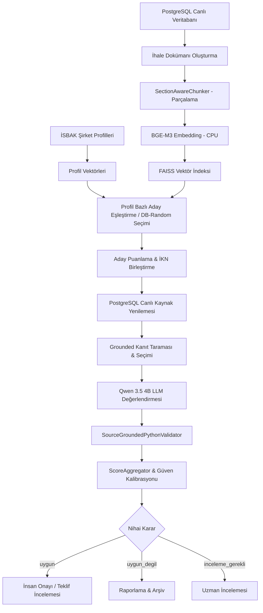

# EKAP–İSBAK İhale Karar Destek Sistemi

RAG (*Retrieval-Augmented Generation*) ve LLM (*Large Language Model*) tabanlı, kaynak doğrulamalı ve deterministik Python kurallarıyla denetlenen ihale değerlendirme ve karar destek altyapısı.

---

## 📌 Proje Hakkında ve Temel İlkeler

Bu proje, EKAP (Elektronik Kamu Alımları Platformu) üzerinde yayımlanan kamu ihalelerini İSBAK A.Ş. Şirket Faaliyet Profilleri (AUS-01..04, ENT-01..04 vb.) ile otomatik ve semantik olarak karşılaştırmak amacıyla geliştirilmiştir.

Sistem, basit bir anahtar kelime veya skor eşleştirmesi yapmaz. **Gömme Vektör Araması (BGE-M3 + FAISS)**, **PostgreSQL Canlı Veri Yenilemesi**, **Qwen 3.5 4B LLM Değerlendirmesi** ve **Python Tabanlı Deterministik Doğrulama Katmanı**'nı tek bir işlem hattında birleştirir.

> [!IMPORTANT]
> **Temel Karar İlkesi & Human-in-the-Loop:**
> Sistem çıktısı doğrudan teklif verme veya ihale tamamlama kararı almaz. Çıktılar (`uygun`, `uygun_degil`, `inceleme_gerekli`), iş geliştirme ve satın alma uzmanlarına sunulacak kanıtlı bir karar desteğidir. Tüm çıktılarda `auto_action_allowed: False` zorunludur ve nihai operasyonel aksiyon insan onayına bağlıdır.

---

## 🛠 Güncel Teknoloji Yığını ve Aktif Mimari

| Katman | Kullanılan Teknoloji / Model | Açıklama |
| :--- | :--- | :--- |
| **Dil / Çalışma Zamanı** | Python 3.12+ (WSL / Linux) | Asenkron ve veri odaklı işlem hattı |
| **Veritabanı (Ground Truth)** | PostgreSQL | Canlı EKAP ihale metinleri, ilanlar, özellikler ve OKAS kodları |
| **Gömme Modeli (Embedding)** | BAAI/bge-m3 | 1024 boyutlu, metin içi anlamsal vektör üretimi (CPU) |
| **Vektör Veritabanı** | FAISS (`IndexIDMap`) | İhale ve şirket profili chunk vektör indeksi |
| **Karar Modeli (LLM)** | Qwen 3.5 4B (`qwen3.5:4b-q4_K_M`) | Ollama `/api/generate` üzerinden JSON Schema zorlamalı kararlar (`think=false`) |
| **Doğrulama Katmanı** | SourceGroundedPythonValidator | Deterministik gerekçe, kaynak tutarlılığı, tahrifat denetimi ve güven kalibrasyonu |
| **Çalıştırma Mimarisi** | `qwen_python_single_model` | Tek LLM + Python doğrulayıcı odaklı güncel üretim hattı |

> [!NOTE]
> **Aktif Sürüm Temizliği:**<br>
> Projede geçmiş deneylere ait olan *Gemma dual-model / fallback yolları*, *Qdrant entegrasyonu* ve *Qwen thinking mode (`think=true`)* kaldırılmıştır. Mevcut üretim hattı **Qwen 3.5 4B (`think=false`) + FAISS + Grounded Python Validation** üzerinde çalışmaktadır.

---

## 🔄 Uçtan Uca Sistem İşlem Hattı



---

## 🧩 Temel Bileşenler ve Mimari Katmanlar

### 1. İndeksleme ve Vektör Yönetimi (`app/indexing` & `app/vector_store`)
* **`SectionAwareChunker`**: İhale metinlerini idari şartname, teknik şartname, ihale ilanları, ihale özellikleri ve OKAS kodları olarak bölümlere ayırarak parçalar.
* **`FaissVectorStore`**: İhale parçalarını `IndexIDMap` yapısıyla indeksler. Harici `tender_id` ve `chunk_id` bilgileri `payloads.pkl` dosyasında tutulur ve internal ID dönüşümü ile FAISS sub-index üzerinden doğrudan vektör erişimi sağlanır.
* **Artımlı İndeksleme (`--missing-from-faiss-only`)**: PostgreSQL'deki aktif ihaleler ile FAISS payload'ındaki ihalelerin farkını (`active_db_ids - existing_faiss_ids`) hesaplayarak yalnızca indekste fiziksel olarak bulunmayan ihaleleri CPU üzerinde indeksler.

### 2. Eşleştirme ve Çalıştırma Modları (`app/matching` & `scripts`)
* **`candidate-pool` Modu**: İSBAK şirket profillerinin vektörlerini FAISS üzerinde sorgulayarak benzerlik skoru en yüksek aday ihaleleri getirir.
* **`database-random` Modu**: PostgreSQL aktif ihale havuzundan rastgele ihaleler seçer, bunlara en uygun İSBAK profilini bağlar ve FAISS snapshot'ında semantik vektör bulunup bulunmadığını (`semantic_evidence_available`) denetler.

### 3. Gerçek Kaynak Yenilemesi & Grounded Kanıt Seçimi (`app/database` & `app/decision`)
* FAISS aramasından elde edilen aday ihaleler **doğrudan karara gönderilmez**. `TenderRepository` aracılığıyla PostgreSQL canlı tablolarından (`tenders`, `tender_announcements`, `tender_characteristics`, `tender_okas_codes`) orijinal ve güncel ihale metni yeniden okunur.
* Metin üzerinde sinyal taraması yapılarak LLM'e sunulacak en ilişkili kanıtlar dinamik olarak seçilir.

### 4. Qwen Karar & Python Doğrulama Katmanı (`app/decision` & `app/validation`)
* **Qwen 3.5 4B**: Ollama API üzerinden katı bir JSON Schema ile çağrılır (`think=false`). Karar etiketi (`uygun`, `uygun_degil`, `inceleme_gerekli`), detaylı Türkçe gerekçe ve atıfta bulunulan kanıtları üretir.
* **`SourceGroundedPythonValidator`**:
  * LLM çıktısındaki kararın gerekçe ile çelişip çelişmediğini kontrol eder.
  * Modelin sunduğu kaynakların orijinal ihale metninde gerçekten var olup olmadığını tahrifat/uydurma (*hallucination*) denetiminden geçirir.
  * Karar ve gerekçeye göre `confidence_score` kalibrasyonu yapar.

---

## 🎯 Karar Sınıfları ve Çıktı Formatı

Sistem her değerlendirme için aşağıdaki üç sınıftan birini üretir:

1. **`uygun`**: İhale konusu İSBAK'ın ana faaliyet ve yetkinlik alanlarıyla eşleşmektedir.
2. **`uygun_degil`**: İhale konusu İSBAK'ın faaliyet alanlarının tamamen dışındadır veya olumsuz kapsam kısıtlarına takılmaktadır.
3. **`inceleme_gerekli`**: Kısmi teklif durumu, sınırda kalan yetkinlikler veya belirsiz ihale şartnameleri nedeniyle uzman insan incelemesi gerekmektedir.

### Örnek Karar Çıktısı (JSON)
```json
{
  "ikn": "2025/2223767",
  "decision": "uygun",
  "reasoning": "İhale konusu akıllı ulaşım ve trafik sinyalizasyon sistemleri bakım-onarım işidir. İSBAK AUS-01 profil yetkinlikleri ile tam uyum sağlamaktadır.",
  "confidence_score": 0.92,
  "auto_action_allowed": false,
  "human_review_required": true,
  "profile_code": "AUS-01",
  "semantic_evidence_available": true
}
```

---

## 📂 Proje Dizin Yapısı

```text
LLM-dev-mert-tek_model/
├── app/                        # Ana Uygulama Modülleri
│   ├── config/                 # Pydantic tabanlı ortam ve sistem ayarları
│   ├── database/               # PostgreSQL bağlantı ve TenderRepository katmanı
│   ├── decision/               # Qwen LLM istemci, prompt yönetimi ve karar modelleri
│   ├── domain/                 # Temel veri modelleri (TenderRecord, ProfileRecord vb.)
│   ├── indexing/               # Metin parçalama (chunker), doküman oluşturucu ve indexer
│   ├── matching/               # Profil-İhale eşleştirme ve skor birleştirici (ScoreAggregator)
│   ├── pipeline/               # İSBAK İhale Analiz Servisi ve işlem hatları
│   ├── reporting/              # JSONL, CSV ve konsol raporlayıcıları
│   ├── retrieval/              # Vektör arama ve metin getirme mantığı
│   ├── validation/             # SourceGroundedPythonValidator ve doğrulama kuralları
│   └── vector_store/           # FaissVectorStore, IndexIDMap ve cache yönetimi
│
├── scripts/                    # CLI Çalıştırma Komutları ve Araçlar
│   ├── build_active_tenders_faiss.py   # Aktif ihaleleri FAISS'e indeksleme (Artımlı / Full)
│   ├── run_tender_decision_chain.py    # Ana karar işlem hattı koşturucusu
│   ├── check_active_tender_index.py   # FAISS indeks durum kontrolü
│   └── check_faiss_integrity.py       # Vektör indeksi bütünlük testi
│
├── tests/                      # Pytest Test Süreçleri
│   ├── decision/               # Karar ve doğrulama mantığı testleri
│   ├── integration/            # Veritabanı ve FAISS entegrasyon testleri
│   └── unit/                   # Birim testler
│
├── storage/                    # Vektör ve İndeks Depolama Altyapısı
│   └── faiss/                  # FAISS index ve payload pkl dosyaları
│
├── reports/                    # İşlem Sonucu Üretilen Raporlar
├── .env.example                # Örnek ortam değişkenleri yapılandırması
├── pytest.ini                  # Pytest ayarları
└── README.md                   # Proje dokümantasyonu
```

---

## 🚀 Kurulum ve Yapılandırma

### 1. Gereksinimler
* **İşletim Sistemi**: Linux veya WSL2 (Windows Subsystem for Linux)
* **Python**: 3.12+
* **Veritabanı**: PostgreSQL (Canlı EKAP veri tabanı erişimi)
* **LLM Sunucusu**: Ollama (`qwen3.5:4b-q4_K_M` modeli yüklü olmalıdır)

### 2. Ortam Hazırlığı
```bash
# Sanal ortam oluşturma ve aktifleştirme
python3 -m venv .venv
source .venv/bin/python3

# Bağımlılıkların yüklenmesi
pip install -r requirements.txt
```

### 3. Çevre Değişkenleri (`.env`)
Örnek yapılandırma için `.env.example` dosyasını kopyalayarak `.env` oluşturun:
```env
DATABASE_HOST=localhost
DATABASE_PORT=5432
DATABASE_NAME=ekap_db
DATABASE_USER=postgres
DATABASE_PASSWORD=your_password

OLLAMA_BASE_URL=http://localhost:11434
PRIMARY_MODEL_NAME=qwen3.5:4b-q4_K_M

EMBEDDING_MODEL=BAAI/bge-m3
EMBEDDING_DEVICE=cpu
```

---

## 💻 Kullanım Rehberi (CLI)

### 1. Aktif İhaleleri FAISS'e İndeksleme (Artımlı İndeksleme)
PostgreSQL'de olup FAISS içinde henüz bulunmayan ihaleleri tespit edip CPU üzerinde indekslemek için:

```bash
# Yalnızca eksik ihaleleri tespit edip test etmek için (Dry-Run)
PYTHONPATH=. .venv/bin/python3 scripts/build_active_tenders_faiss.py --missing-from-faiss-only --dry-run

# Eksik ihaleleri FAISS'e gerçek olarak eklemek için
PYTHONPATH=. .venv/bin/python3 scripts/build_active_tenders_faiss.py --missing-from-faiss-only
```

### 2. Ana Karar İşlem Hattını Çalıştırma
Profil bazlı aday havuzu veya rastgele veri tabanı seçimi ile karar hattını koşturma:

```bash
# Candidate-Pool modunda çalıştırma
PYTHONPATH=. .venv/bin/python3 scripts/run_tender_decision_chain.py --mode candidate-pool --limit 10

# Database-Random modunda (PostgreSQL canlı ihalelerinden rastgele seçim) çalıştırma
PYTHONPATH=. .venv/bin/python3 scripts/run_tender_decision_chain.py --mode database-random --limit 10 --seed 42
```

---

## 🧪 Test ve Doğrulama

Tüm birim ve entegrasyon testlerini koşturmak için:

```bash
# Tüm test paketini koşturma
PYTHONPATH=. .venv/bin/python3 -m pytest

# Syntax ve derleme kontrolü
PYTHONPATH=. .venv/bin/python3 -m compileall app scripts tests

# Git diff ve boşluk kontrolü
git diff --check
```

---

## 🛡 Güvenlik, Sınırlar ve Doğruluk Garantileri

1. **FAISS Bütünlük Garantisi**: İndeksleme veya vektör güncelleme sırasında atomik kaydetme yöntemi (`replace_tenders_records`) kullanılır. Olası bir hatada otomatik rollback yapılarak `.index` ve `.pkl` dosyalarının bozulması engellenir.
2. **Deterministik Doğrulama**: LLM'in ürettiği gerekçe metinleri `SourceGroundedPythonValidator` tarafından kaynak ihale metniyle taranır. Eğer model metinde geçmeyen bir şartname maddesi uydurursa karar otomatik olarak `inceleme_gerekli` seviyesine çekilir ve güven puanı düşürülür.
3. **Kaynak Sınırı**: Üretim mimarisinde tüm gömme (embedding) ve LLM karar adımları CPU üzerinde çalışacak şekilde yapılandırılmıştır.