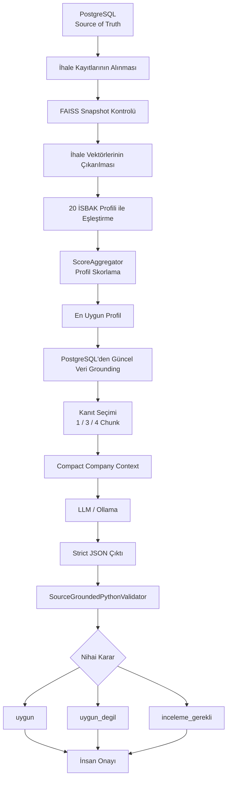
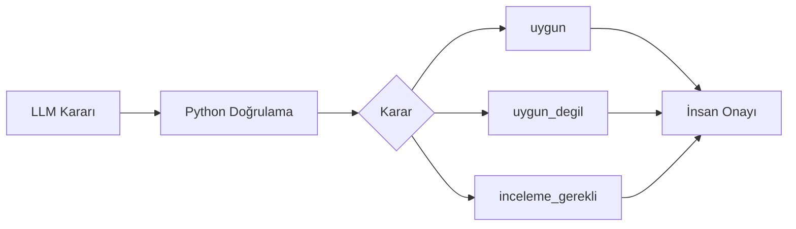

# EKAP–İSBAK İhale Karar Destek Sistemi

> **CPU-only, kaynak kanıtlı ve insan onaylı ihale karar destek sistemi**  
> PostgreSQL + FAISS + BGE-M3 + Ollama/LLM + deterministik Python doğrulama

---

## İçindekiler

- [1. Proje Özeti](#1-proje-özeti)
- [2. Temel Amaçlar](#2-temel-amaçlar)
- [3. Güncel Mimari](#3-güncel-mimari)
- [4. Karar Akışı](#4-karar-akışı)
- [5. PostgreSQL ve FAISS'in Rolleri](#5-postgresql-ve-faissin-rolleri)
- [6. Şirket Faaliyet Profilleri](#6-şirket-faaliyet-profilleri)
- [7. Vektörleştirme ve FAISS İndeksi](#7-vektörleştirme-ve-faiss-indeksi)
- [8. Profil Eşleştirme ve Skorlama](#8-profil-eşleştirme-ve-skrolama)
- [9. Kanıt Seçimi](#9-kanıt-seçimi)
- [10. Compact Context](#10-compact-context)
- [11. LLM Karar Katmanı](#11-llm-karar-katmanı)
- [12. Python Doğrulama Katmanı](#12-python-doğrulama-katmanı)
- [13. Nihai Karar Sınıfları](#13-nihai-karar-sınıfları)
- [14. İnsan Onayı ve Güvenlik](#14-insan-onayı-ve-güvenlik)
- [15. Performans ve Son Optimizasyonlar](#15-performans-ve-son-optimizasyonlar)
- [16. Model Kıyaslama Protokolü](#16-model-kıyaslama-protokolü)
- [17. Proje Dizin Yapısı](#17-proje-dizin-yapısı)
- [18. Kurulum](#18-kurulum)
- [19. Yapılandırma](#19-yapılandırma)
- [20. Çalıştırma](#20-çalıştırma)
- [21. Testler](#21-testler)
- [22. Rapor Çıktıları](#22-rapor-çıktıları)
- [23. Bilinen Sınırlamalar](#23-bilinen-sınırlamalar)
- [24. Tasarım Kararları](#24-tasarım-kararları)

---

# 1. Proje Özeti

**EKAP–İSBAK İhale Karar Destek Sistemi**, EKAP üzerinde yayımlanan kamu ihalelerini İSBAK A.Ş. faaliyet profilleriyle eşleştirerek, hangi ihalenin hangi iş alanıyla ilişkili olduğunu belirleyen ve karar verici personele **gerekçeli, kaynak kanıtlı ve denetlenebilir** çıktı sunan bir yapay zekâ destekli karar sistemidir.

Sistem şu temel bileşenleri birlikte kullanır:

- **PostgreSQL** → güncel ve otoritatif ihale verisi,
- **FAISS** → hızlı anlamsal getirim (semantic retrieval),
- **BGE-M3** → ihale ve profil gömmeleri (embeddings),
- **LLM** → bağlam yorumlama ve gerekçeli karar taslağı,
- **Python doğrulayıcı** → deterministik iş kuralları ve kaynak doğrulaması,
- **Human-in-the-Loop** → nihai insan kontrolü.

> [!IMPORTANT]
> Sistem bir **otomatik teklif verme sistemi değildir**.  
> Amacı, büyük ihale havuzunu daraltmak, doğru faaliyet profilini bulmak ve karar vericiye güvenilir bir ön değerlendirme sunmaktır.

---

# 2. Temel Amaçlar

### Hedef ihaleleri hızlı biçimde belirlemek
Binlerce ihale arasından şirket faaliyet alanlarıyla ilişkili olanları önceliklendirir.

### Manuel inceleme yükünü azaltmak
Satın alma ve uzman ekiplerin alakasız ihaleleri tek tek inceleme ihtiyacını azaltır.

### LLM'i tek başına karar verici yapmamak
LLM muhakemesi, deterministik Python kuralları ve kaynak doğrulaması ile kontrol edilir.

### Yanlış pozitif ve yanlış negatifleri azaltmak
Genel kelime benzerliklerinin yanlış uygunluk üretmesi veya gerçek fırsatların kaçırılması engellenmeye çalışılır.

### Gerekçeli karar üretmek
Sadece etiket değil; kararın hangi kanıta dayandığını da raporlar.

### Minimum donanım, maksimum verim
Sistem **GPU zorunluluğu olmadan, CPU üzerinde** çalışabilecek şekilde tasarlanmıştır.

---

# 3. Güncel Mimari



Bu mimaride LLM yalnızca tek bir katmandır. Nihai güvenlik ve karar tutarlılığı, **canlı veri + kaynak kanıtı + Python doğrulama** üçlüsüyle sağlanır.

---

# 4. Karar Akışı

Bir ihale için uçtan uca akış:

```text
1. PostgreSQL'den ihale kaydı alınır
2. İhalenin FAISS snapshot içinde bulunup bulunmadığı kontrol edilir
3. İhale vektörleri çıkarılır
4. 20 şirket profili ile benzerlik hesaplanır
5. Profil skorları hesaplanır
6. En uygun profil seçilir
7. Güncel ihale verisi PostgreSQL'den yeniden doğrulanır
8. Karar için en anlamlı kanıt parçaları seçilir
9. Şirket profili compact context formatına dönüştürülür
10. LLM'e tek karar isteği gönderilir
11. JSON çıktısı Python doğrulayıcıdan geçirilir
12. Güven skoru kalibre edilir
13. Nihai sınıf üretilir
14. İnsan aksiyon kuyruğuna raporlanır
```

---

# 5. PostgreSQL ve FAISS'in Rolleri

| Bileşen | Rol |
|---|---|
| **PostgreSQL** | Güncel, otoritatif ihale verisi |
| **FAISS** | Anlamsal aday bulma ve vektör benzerliği |
| **LLM** | Bağlam yorumlama ve gerekçeli karar |
| **Python** | Kaynak doğrulama ve deterministik iş kuralları |

FAISS **nihai karar kaynağı değildir**.

FAISS yalnızca:

- hangi ihalenin hangi profile yakın olduğunu,
- hangi chunk'ların kanıt adayı olduğunu,
- hangi kayıtların LLM analizine gönderilmesinin mantıklı olduğunu

belirlemek için kullanılır.

Karara girecek gerçek metin gerektiğinde tekrar PostgreSQL üzerinden doğrulanır.

> [!WARNING]
> FAISS snapshot'ın PostgreSQL'den geri kalması karar kalitesini doğrudan bozmasa da, **yeni ihalelerin radara girme hızını düşürür**.

Son 20 ihale testinde:

- aktif PostgreSQL havuzu: **4.347 ihale**
- incelenen kayıt: **1.304**
- FAISS snapshot'ta bulunmayan: **1.281**
- modele gönderilen: **20**

Bu veri, üretim ortamında düzenli incremental (artımlı) FAISS güncellemesinin kritik olduğunu göstermektedir.

---

# 6. Şirket Faaliyet Profilleri

Sistem 20 aktif İSBAK faaliyet profili kullanır.

Örnekler:

| Kod | Profil |
|---|---|
| `AUS-01` | Trafik Yönetimi ve Sinyalizasyon |
| `AUS-04` | Toplu Taşıma ve Raylı Sistem Teknolojileri |
| `ENT-02` | Kamera, Video Analitik ve Güvenlik Sistemleri |
| `TEK-01` | Yazılım, Veri ve Sistem Bütünleştirme |
| `TEK-04` | Bilgi ve Siber Güvenlik |
| `OPS-02` | Bakım, Onarım ve Teknik Destek |

Profil JSON yapısında tipik olarak şu alanlar bulunur:

- profil adı,
- faaliyet açıklaması,
- primary capabilities,
- strong terms,
- supporting terms,
- negative terms,
- teknik ekipman,
- abbreviations / jargon,
- action verbs,
- OKAS kodları.

Profil verileri hem **FAISS profil vektörlerinin** oluşturulmasında hem de **LLM company context** üretiminde kullanılır.

---

# 7. Vektörleştirme ve FAISS İndeksi

## BGE-M3

İhale metinleri `BAAI/bge-m3` ile embedding (gömme) vektörlerine dönüştürülür.

- Boyut: **1024**
- Donanım: **CPU**
- Kullanım: ihale ve profil anlamsal karşılaştırması

## Section-Aware Chunking

Büyük ihale dokümanları tek parça halinde modele verilmez.

Metin:

- teknik şartname,
- idari şartname,
- ilan,
- açıklama,
- kapsam,
- OKAS ve benzeri alanlar

üzerinden mantıksal chunk'lara ayrılır.

## Ayrı FAISS indeksleri

```text
storage/
├── faiss/
│   ├── ekap_tender_chunks.index
│   └── payloads.pkl
└── faiss_profiles/
    ├── isbak_company_profiles.index
    └── payloads.pkl
```

İhale ve şirket profil vektörleri ayrı indekslerde tutulur.

---

# 8. Profil Eşleştirme ve Skorlama

Profil skorlama `ScoreAggregator` tarafından yapılır.

Temel bileşenler:

| Bileşen | Ağırlık |
|---|---:|
| En güçlü chunk benzerliği | %55 |
| Top-mean / ortalama benzerlik | %20 |
| Bölüm çeşitliliği | %10 |
| OKAS desteği | %10 |
| Başlık desteği | %5 |

Ek olarak negative terms eşleşmeleri durumunda ceza uygulanabilir.

> [!CAUTION]
> `score=0.70` ifadesi **"%70 uygun"** anlamına gelmez.  
> Bu değer bir **retrieval / ranking score** yani aday sıralama puanıdır.

## Son Performans Optimizasyonu

Profil skorlama katmanında iki önemli optimizasyon uygulanmıştır:

### 1. Profile Runtime Cache
Profil metadata, profil vektörleri ve sorgu terimleri ihale döngüsünün dışına taşınmış ve yalnızca bir kez hazırlanmıştır.

### 2. `scope_terms.py` Window-Bounded Matching
`contains_term()` eşleştirme algoritması, her başlangıç noktasından metnin tamamını tekrar taramak yerine yalnızca geçerli eşleşme penceresini tarayacak şekilde yeniden düzenlenmiştir.

Ek olarak:

```python
@lru_cache(maxsize=32768)
```

ile `token_matches()` sonuçları tekrar kullanılmaktadır.

Bu revizyon:

- 25 ilgili pytest testinden geçti,
- eski/yeni `contains_term()` davranışı 130 kombinasyonda karşılaştırıldı,
- 0 sonuç farkı gözlendi.

---

# 9. Kanıt Seçimi

LLM'e tüm ihale dokümanı gönderilmez.

Kanıt seçimi dinamik yapılır:

| Durum | Kanıt Sayısı | Amaç |
|---|---:|---|
| `clear` | 1 | Çok net eşleşmeler |
| `ambiguous` | 3 | Belirsiz eşleşmeler |
| `mixed / partial` | 4 | Karma veya kısmi uygunluk |

Bu sayı LLM çağrı sayısı değil, **tek LLM çağrısındaki ihale chunk sayısıdır**.

---

# 10. Compact Context

Şirket profilinin ham JSON hali LLM'e doğrudan gönderilmez.

Compact context:

- boş alanları kaldırır,
- tekrarları temizler,
- kritik karar alanlarını korur,
- token tüketimini azaltır.

Örnek gerçek ölçümler:

```text
AUS-04:
legacy_raw_chars = 6106
compact_final_chars = 1294

TEK-01:
legacy_raw_chars = 8325
compact_final_chars = 2121
```

## Integrity Guard

Compact context üretimi sonrası kritik alanların korunduğu doğrulanır.

```text
compact_integrity_passed=True
```

Kritik veri kaybı algılanırsa sistem legacy context'e geri dönebilir.

---

# 11. LLM Karar Katmanı

Üretim sisteminin ana modeli:

```text
qwen3.5:4b-q4_K_M
```

Varsayılan çalışma yaklaşımı:

```text
Platform       : Ollama
GPU            : kapalı
num_gpu        : 0
num_ctx        : 8192
temperature    : 0
think          : False
Output         : Strict JSON
```

> [!NOTE]
> Model benchmark çalışmaları sırasında `QWEN_MODEL` çevresel değişkeni üzerinden farklı modeller aynı karar hattında test edilebilir.

LLM'in görevi:

- ihale ile seçilen profil arasındaki ilişkiyi yorumlamak,
- gerekçe oluşturmak,
- kanıt ID'lerini kullanmak,
- yapılandırılmış JSON karar taslağı üretmektir.

LLM **nihai kararın tek sahibi değildir**.

---

# 12. Python Doğrulama Katmanı

`SourceGroundedPythonValidator`, model kararının güvenlik filtresidir.

## Kontroller

### Kaynak bütünlüğü
Modelin referans verdiği kanıtların gerçekten var olup olmadığı kontrol edilir.

### Pozitif faaliyet doğrulaması
Model `uygun` dediyse, ihale metninde gerçekten profil faaliyetini destekleyen güçlü kanıt aranır.

### Negatif faaliyet doğrulaması
Model `uygun_degil` dediyse, kararın:

- profile negative terms,
- proven out-of-scope,
- açık faaliyet dışı ifade

ile doğrulanması beklenir.

### Confidence calibration
Python güven skorunu yükseltmez; gerektiğinde sınırlar veya düşürür.

### Güvenli geri çekilme
Belirsizlik oluştuğunda:

```text
inceleme_gerekli
```

kararı tercih edilir.

---

# 13. Nihai Karar Sınıfları

## `uygun`

Faaliyet kapsamı açısından profil ile ihale arasında doğrulanmış bir eşleşme vardır.

Bu:

> "İhale kesin kazanılır"

anlamına gelmez.

## `uygun_degil`

İhale faaliyet kapsamı dışında veya doğrulanmış negatif kapsam içindedir.

## `inceleme_gerekli`

Sistem güvenilir otomatik sınıflandırma yapamadığında insan uzmanına devreder.

Tipik nedenler:

- yetersiz kanıt,
- çelişkili kanıt,
- kısmi uygunluk,
- zorunlu kriter belirsizliği,
- LLM kararının Python tarafından doğrulanamaması.

---

# 14. İnsan Onayı ve Güvenlik

Sistemin temel güvenlik prensibi:

```text
automatic_action_allowed = False
```

Sistem:

- EKAP'a otomatik teklif vermez,
- ihale başvurusu yapmaz,
- sözleşme işlemi başlatmaz,
- insan onayı olmadan operasyonel aksiyon almaz.



---

# 15. Performans ve Son Optimizasyonlar

Sistem "Minimum Donanım, Maksimum Verim" yaklaşımıyla CPU-only çalışacak şekilde optimize edilmektedir.

## 10 İhale Performans Gelişimi

| Sürüm | Toplam Süre | Profil Seçimi |
|---|---:|---:|
| İlk ölçüm | **45 dk 6 sn** | **26 dk 46 sn** |
| Profile cache sonrası | **39 dk 1 sn** | **21 dk 23 sn** |
| `scope_terms` optimizasyonu sonrası | **17 dk 53 sn** | **1,94 sn** |

Profil seçimi:

```text
26 dk 46 sn
      ↓
21 dk 23 sn
      ↓
1,94 sn
```

seviyesine indirilmiştir.

## 38 Chunk'lık Zor Vaka

`2026/1312787` için profil seçimi:

```text
İlk sürüm          : 12 dk 30 sn
Profile cache      : 9 dk 45 sn
Scope optimization : 0,42 sn
```

## 20 İhale Testi

Son 20 ihale testinde:

| Metrik | Sonuç |
|---|---:|
| Toplam karar | 20 |
| Hata | 0 |
| Profil | 20 |
| Profil karşılaştırması | 400 |
| Profil seçimi toplamı | ~3,5 sn |
| Toplam çalışma | ~32 dk 13 sn |
| `uygun` | 2 |
| `uygun_degil` | 14 |
| `inceleme_gerekli` | 4 |

> [!IMPORTANT]
> Profil seçimi artık sistem darboğazı değildir.  
> Model öncesi PostgreSQL + FAISS + Python skorlama hattı saniyeler seviyesinde çalışmaktadır.

---

# 16. Model Kıyaslama Protokolü

Aynı sistem hattı üzerinde farklı modeller karşılaştırılabilir.

Testlerde tüm modeller için mümkün olduğunca aynı koşullar korunur:

- aynı 10 ihale,
- aynı PostgreSQL verisi,
- aynı FAISS snapshot,
- aynı 20 profil,
- aynı prompt,
- aynı Python validator,
- `num_ctx=8192`,
- `num_gpu=0`,
- CPU-only çalışma.

## Ölçülen Performans Metrikleri

### Süre
- PostgreSQL retrieval,
- FAISS retrieval,
- profile selection,
- LLM `load_duration`,
- LLM `prompt_eval_duration`,
- LLM `eval_duration`,
- LLM `total_duration`,
- uçtan uca toplam süre.

### Model
- prompt token count,
- output token count,
- prompt tokens/sec,
- generation tokens/sec.

### Sistem Kaynakları
- Python RSS,
- Ollama RSS,
- toplam sistem RAM,
- swap,
- CPU kullanım oranı.

### Kalite
- karar dağılımı,
- hata sayısı,
- Python validation pass/fail,
- selected profile,
- retrieval score.

---

# 17. Proje Dizin Yapısı

```text
.
├── app/
│   ├── config/              # Pydantic ayarları ve çevresel yapılandırma
│   ├── database/            # PostgreSQL repository ve modeller
│   ├── decision/            # LLM karar hattı ve Python validator
│   ├── domain/              # Ortak domain modelleri
│   ├── indexing/            # FAISS indeksleme süreçleri
│   ├── matching/            # Profil eşleştirme ve ScoreAggregator
│   ├── pipeline/            # Uçtan uca karar zinciri
│   ├── reporting/           # CSV / JSONL / özet rapor üretimi
│   ├── retrieval/           # Kanıt ve vektör retrieval katmanı
│   └── vector_store/        # FAISS storage wrapper'ları
│
├── config/
│   └── isbak/               # 20 şirket faaliyet profili
│
├── scripts/
│   ├── build_active_tenders_faiss.py
│   ├── build_profiles_faiss.py
│   ├── run_tender_decision_chain.py
│   ├── check_database.py
│   ├── check_faiss_integrity.py
│   └── monitor_system_resources.py
│
├── experiments/
│   └── model_benchmark/     # Sabit ihale model kıyaslama testleri
│
├── storage/
│   ├── faiss/
│   └── faiss_profiles/
│
├── reports/                 # Test ve karar çıktıları
├── tests/
├── requirements.txt
└── README.md
```

---

# 18. Kurulum

Ubuntu / WSL Ubuntu:

```bash
python3 -m venv .venv
source .venv/bin/activate

python3 -m pip install --upgrade pip
python3 -m pip install -r requirements.txt
```

Ollama:

```bash
ollama --version
ollama list
```

---

# 19. Yapılandırma

Örnek `.env`:

```env
DATABASE_HOST=127.0.0.1
DATABASE_PORT=5433
DATABASE_NAME=ekap_db
DATABASE_USER=ekap_reader
DATABASE_PASSWORD=degistirin

OLLAMA_BASE_URL=http://127.0.0.1:11434

QWEN_MODEL=qwen3.5:4b-q4_K_M
QWEN_DECISION_NUM_CTX=8192
QWEN_DECISION_NUM_PREDICT=1024

OLLAMA_NUM_THREAD=4
OLLAMA_NUM_BATCH=32
OLLAMA_NUM_GPU=0

COMPANY_CONTEXT_MODE=true
```

> [!CAUTION]
> Gerçek kullanıcı adı, parola, host veya kurumsal erişim bilgileri README içine yazılmamalıdır.

---

# 20. Çalıştırma

## Veritabanı kontrolü

```bash
PYTHONPATH=. python3 scripts/check_database.py
```

## FAISS bütünlük kontrolü

```bash
PYTHONPATH=. python3 scripts/check_faiss_integrity.py
```

## En yeni 10 uygun ihale

```bash
PYTHONPATH=. python3 scripts/run_tender_decision_chain.py \
  --source-mode database \
  --selection-mode database-sequential \
  --max-decisions 10 \
  --log-level INFO
```

## Rastgele ihale seçimi

```bash
PYTHONPATH=. python3 scripts/run_tender_decision_chain.py \
  --source-mode database \
  --selection-mode database-random \
  --max-decisions 10 \
  --random-seed 42 \
  --log-level INFO
```

---

# 21. Testler

Tüm testler:

```bash
PYTHONPATH=. python3 -m pytest -q
```

Karar / kapsam testleri:

```bash
PYTHONPATH=. python3 -m pytest -q tests \
  -k 'scope_terms or score_aggregator or activity_scope'
```

Son `scope_terms` performans revizyonunda:

```text
25 passed
427 deselected
```

Ayrıca eski/yeni `contains_term()` davranışı:

```text
130 kombinasyon
0 davranış farkı
```

ile karşılaştırılmıştır.

---

# 22. Rapor Çıktıları

Karar zinciri tamamlandığında `reports/` altında aşağıdaki çıktılar üretilebilir:

| Dosya | Amaç |
|---|---|
| `tender_model_decisions*.jsonl` | Ham model ve doğrulama verisi |
| `tender_public_decisions*.jsonl` | Sade kullanıcı çıktısı |
| `tender_model_decisions*.csv` | Teknik/debug çıktı |
| `tender_public_decisions*.csv` | Sade CSV |
| `tender_review_required*.csv` | İnsan incelemesi gereken kayıtlar |
| `tender_human_action_queue*.csv` | İnsan aksiyon kuyruğu |
| `tender_professional_decisions*.csv` | Yönetici/uzman görünümü |
| `database_sequential_selection*.csv` | İhale seçim ve FAISS durumu |
| `tender_decision_run_summary*.json` | Koşu özeti |
| `full_terminal.log` | Tam terminal günlüğü |
| `premodel_timing.log` | Model öncesi süreler |
| `ollama_diagnostics.log` | LLM tanılama metrikleri |
| `system_resources.csv` | CPU/RAM/swap ölçümleri |

---

# 23. Bilinen Sınırlamalar

### PostgreSQL–FAISS senkronizasyon gecikmesi
Yeni ihaleler PostgreSQL'e geldikten sonra FAISS güncellenene kadar semantik aday havuzuna giremeyebilir.

### Negative Scope kalibrasyonu
Bazı teknoloji, bakım veya karma ihalelerde `proven_out_of_scope` kuralları fazla agresif davranabilir.

Özellikle regression test olarak takip edilen örneklerden biri:

```text
2026/1305224
Kurumsal Kimlik, Ayrıcalıklı Hesap Yönetimi,
Statik ve Dinamik Kod Tarama Yazılımları Lisans Yenileme
```

### CPU-only LLM inference
LLM çıkarımı GPU'suz ortamda sistemin en maliyetli katmanıdır.

### LLM deterministik değildir
`temperature=0` kullanılsa bile model davranışı matematiksel anlamda %100 deterministik kabul edilmemelidir.

---

# 24. Tasarım Kararları

## Neden LangChain kullanılmadı?

Bu projede işlem hattı özel Python modülleriyle kuruldu.

Temel nedenler:

- daha az bağımlılık,
- düşük bellek ek yükü,
- deterministik akış,
- daha kolay debugging,
- her karar adımının ölçülebilir olması,
- kurumsal kontrol ve denetlenebilirlik.

## Neden PostgreSQL + FAISS?

PostgreSQL ve FAISS farklı problemlere çözüm getirir:

```text
PostgreSQL → gerçek veri
FAISS      → hızlı anlamsal arama
```

Bu ayrım, vektör indeksinin güncellik sorunlarının karar kaynağına dönüşmesini engeller.

## Neden Python Validator?

LLM:

- metni iyi yorumlar,
- bağlam kurar,
- gerekçe oluşturur.

Python:

- katı kural uygular,
- kaynak doğrular,
- skor hesaplar,
- güvenlik sınırı koyar.

Bu iki yaklaşım birlikte kullanıldığında sistem daha kontrollü hale gelir.

## Neden CPU-only?

Projenin temel hedeflerinden biri yüksek donanım bağımlılığını azaltmaktır.

CPU-only çalışma:

- kurulum maliyetini düşürür,
- GPU bağımlılığını kaldırır,
- kurumsal ortamlarda dağıtımı kolaylaştırır,
- verinin kurum sınırları içinde kalmasını destekler.

---

## Kısa Mimari Özeti

```text
Canlı PostgreSQL
      │
      ▼
FAISS Retrieval
      │
      ▼
20 Profil Arasında Skorlama
      │
      ▼
En Uygun Profil
      │
      ▼
Kanıt Seçimi + Compact Context
      │
      ▼
LLM
      │
      ▼
Python Validator
      │
      ▼
uygun / uygun_degil / inceleme_gerekli
      │
      ▼
İnsan Onayı
```

---

**EKAP–İSBAK İhale Karar Destek Sistemi**, yüksek hacimli ihale verisini düşük donanım maliyetiyle analiz etmeyi; LLM muhakemesini deterministik Python kurallarıyla sınırlandırmayı ve insan karar vericiye kaynak kanıtlı, denetlenebilir bir karar desteği sunmayı amaçlar.
