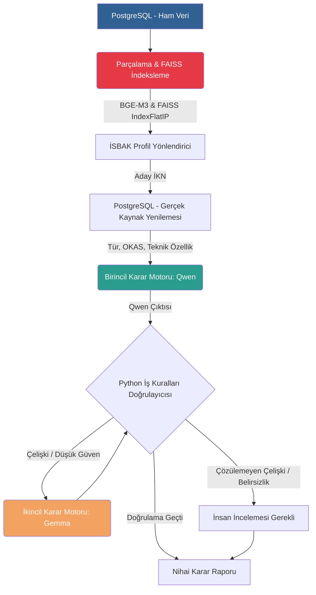

<div align="center">
  
  
  # EKAP İSBAK İhale Analiz Sistemi
  
  **Yapay Zeka Destekli Otonom RAG (Retrieval-Augmented Generation) Karar Motoru**

  [](https://www.python.org/downloads/)
  [](https://www.postgresql.org/)
  [](https://github.com/facebookresearch/faiss)
  [](https://ollama.ai/)
</div>

<br />

## 📖 İçindekiler
- [🎯 Projenin Amacı](#-projenin-amacı)
- [🏗️ Sistem Mimarisi ve Bileşenler](#-sistem-mimarisi-ve-bileşenler)
- [🔄 Sistem Akışı (Uçtan Uca)](#-sistem-akışı-uçtan-uca)
- [✨ Temel Özellikler](#-temel-özellikler)
- [📊 Aday Puanı Hesaplaması](#-aday-puanı-hesaplaması)
- [⚖️ Karar Sınıfları](#-karar-sınıfları)
- [🚀 Kurulum](#-kurulum)
- [💻 Kullanım](#-kullanım)
- [📂 Klasör Yapısı](#-klasör-yapısı)
- [⚠️ Sınırlar ve Gereksinimler](#-sınırlar-ve-gereksinimler)

---

## 🎯 Projenin Amacı

Bu proje, Türkiye Cumhuriyeti Elektronik Kamu Alımları Platformu (EKAP) üzerinde yayınlanan ihalelerin **İstanbul Bilişim ve Akıllı Kent Teknolojileri A.Ş. (İSBAK)** çalışma alanlarına ve kurumsal profillerine (Yazılım, Donanım, Ar-Ge vb.) uygunluğunu otonom olarak analiz eden yapay zeka (LLM) destekli bir karar motorudur.

Sistem; oldukça hacimli olan ihale şartnamelerini, ilanları ve idari gereksinimleri **Anlamsal Arama (FAISS)** yöntemiyle tarar. LLM halüsinasyonlarını engellemek adına modellerin çıktılarını kapalı kutu (blackbox) olarak kabul etmez; Python tabanlı sıkı iş kuralları ve deterministik hata denetim zinciri ile modelleri sınayarak yönlendirir ve katı kurallara bağlı bir karar (*uygun*, *uygun_değil*, *inceleme_gerekli*) üretir.

---

## 🏗️ Sistem Mimarisi ve Bileşenler

Sistem, yapay zeka uydurmalarını en aza indirmek için "Çift Katmanlı LLM" ve "Python Kural Doğrulayıcısı" mimarisini kullanır.



### 1. Veri Kaynağı ve Vektör Arama
- **PostgreSQL:** İhalelere ait ham özellikler ve OKAS kodları salt okunur çekilir.
- **BGE-M3 Embedding:** İhale "kapsam", "teknik özellik" ve "idari" bölümleri mantıksal yapıları bozulmadan vektörize edilir.
- **FAISS:** Bellek-içi L2-normalize `IndexFlatIP` yapısıyla, binlerce ihale parçası içinden İSBAK profiline en uygun kısımları milisaniyeler içerisinde anlamsal olarak getirir.

### 2. Karar Mekanizması (Ollama)
Karar süreci iki açık kaynaklı yerel model ile çift katmanlı yürütülür:
- **Birincil Karar Motoru (Qwen - `qwen3.5:4b-q4_K_M`):** FAISS'ten gelen ihale parçalarını İSBAK profilleriyle karşılaştırır. Zorunlu kriterleri ve eksik kanıtları belirleyerek taslak karar üretir.
- **İkincil Görüş (Gemma - `gemma4:e2b-it-q4_K_M`):** Birincil model düşük güvenle karar verirse veya sistemsel bir uyuşmazlık çıkarsa devreye girer. Bağımsız olarak aynı veriyi analiz eder.

### 3. Doğrulama ve Yönlendirme (Python Guardrails)
- **IsbakDeterministicValidator:** İki model arasında çelişki varsa kararı "inceleme_gerekli" yapar. Modelin ürettiği her kriteri ve referans (chunk) kimliğini tek tek denetler.
- **Anlamsal Denetim:** Fiyat avantajı gibi haksız elenme sebeplerini veya uydurma kaynak kodlarını engeller. Eksik veya hatalı JSON yanıtlarında LLM'den düzeltme (retry) istenir.

---

## 🔄 Sistem Akışı (Uçtan Uca)

1. **Veri Toplama:** PostgreSQL'den okunan güncel ihaleler, hash takibiyle sadece değişen kısımlarıyla parçalanıp FAISS'e eklenir.
2. **Aday Arama:** Şirket profilleri FAISS'te sorgulanır, formül ile 0.35 barajı üzerindeki ihaleler seçilir.
3. **Birincil Analiz (LLM):** Qwen modeli JSON formatında zorunlu alanlarla (ModelDecision) bir analiz üretir.
4. **Semantik Doğrulama & Düzeltme:** Geçersiz ihale parça kodları veya yanlış ret sebepleri bulunursa, sistem modele uyarı mesajıyla (*"Eksik kanıtı düzelt vb."*) hatasını düzeltmesi için yeniden istek atar (`max_json_corrections`).
5. **Güvenli Kurtarma:** Yardımcı kısımlarda mantık hatası kalsa bile ana karar (decision) kurtarılır.
6. **İkincil Görüş:** Çelişki riski varsa ikincil model (Gemma) çağrılır, Python boru hattında karşılaştırılır.
7. **İnsan Kapısı ve Raporlama:** `inceleme_gerekli` olanlar insan incelemesine ayrılır, `uygun` olanlar insan onayına sunulur. Otomatik işlem kapalıdır. Nihai karar diskteki `reports/` klasörüne (CSV, JSONL) kaydedilir.

---

## ✨ Temel Özellikler

- **Bölüm Farkındalıklı Parçalama:** Kapsam, teknik özellik ve idari bölümler tek metne sıkıştırılmaz, mantıksal formlarında ayrı ayrı parçalanır.
- **Deterministik Önbellekleme:** Gereksiz LLM (Embedding) maliyetini önlemek için `source_hash` takibi yapılır. Sadece değişen veriler yeniden indekslenir.
- **Python Guardrails:** Yapay zekanın kapalı kutu (blackbox) kararları deterministik kurallarla yönlendirilir. LLM kendi başına kuralsız karar veremez.
- **Benzersiz İhale Birleştirmesi:** Aynı İKN'nin farklı profillerdeki eşleşmeleri birincil ve destekleyici profiller olarak tek model çağrısında birleştirilir.
- **Graceful Degradation (Güvenli Kurtarma):** LLM'in tamamen çökmesi veya uyumsuz çıktılarında sistem toptan iptal olmak yerine, kullanılabilir bölümleri kurtarır.
- **İSBAK İzolasyonu:** İSBAK A.Ş. tarafından açılan kurum-içi ihaleler analizden otomatik olarak dışlanır.

---

## 📊 Aday Puanı Hesaplaması

Aday ihalelerin uygunluk derecesi, FAISS aramasından gelen metriklerle hesaplanır:

**Nihai Puan =** 
  `(0.55 × En Yüksek Parça Skoru)` + 
  `(0.20 × En İyi Parçaların Ortalama Skoru)` + 
  `(0.10 × Bölüm Çeşitlilik Skoru)` + 
  `(0.10 × OKAS Destek Skoru)` + 
  `(0.05 × Başlık Destek Skoru)`

Eğer ihale ile profil arasında uyumsuzluk tespit edilirse **0.10** oranında **Profil Uyuşmazlığı Cezası** düşülür. Nihai puan `0.35` altındaysa ihale LLM değerlendirmesine (aday havuzuna) alınmaz.

---

## ⚖️ Karar Sınıfları

| Karar | Açıklama |
| :--- | :--- |
| 🟢 **uygun** | İhale faaliyet konusu, seçilen İSBAK profilinin ürün/hizmet kapsamıyla kanıtlı biçimde örtüşmektedir. |
| 🔴 **uygun_degil** | İhale faaliyet konusu profil kapsamı dışındadır veya doğrulanmış negatif kapsamla çelişmektedir. |
| 🟡 **inceleme_gerekli** | Faaliyet kapsamı belirsizdir, iki model çelişmiştir veya Python doğrulaması modelin kanıtlarını yetersiz bulmuştur. |

---

## 🚀 Kurulum

### Ön Koşullar
- Python 3.11 veya üzeri
- PostgreSQL Veritabanı (Mevcut EKAP verisi)
- Ollama (Qwen ve Gemma modellerinin yüklü olduğu LLM sunucusu)
- FAISS (CPU/GPU uyumlu)

### 1. Depoyu Klonlayın
```bash
git clone https://github.com/KeremUUnal/EkapLLM.git
cd EkapLLM
```

### 2. Sanal Ortam ve Bağımlılıklar
```bash
python -m venv .venv
source .venv/bin/activate  # Windows için: .venv\Scripts\activate
pip install -e ".[dev]"
```

### 3. Ortam Değişkenleri
```bash
cp .env.example .env
```
`.env` dosyanızı PostgreSQL ve Ollama sunucu bilgilerinize göre düzenleyin.

---

## 💻 Kullanım

### 1. Aktif İhaleleri FAISS İndeksine Ekleme
Ekap ihalelerini PostgreSQL'den okuyup `BGE-M3` ile vektörize eder:
```bash
python scripts/build_active_tenders_faiss.py --recreate
```
Sadece yeni/değişen ihaleleri eklemek için parametresiz çalıştırın:
```bash
python scripts/build_active_tenders_faiss.py
```

### 2. Aday İhaleleri Test Etme (Retrieval)
Arama algoritmasını ve İSBAK profilleriyle eşleşmeleri LLM çalıştırmadan önce test etmek için:
```bash
python scripts/test_faiss_retrieval.py
```

### 3. Model Karar Zincirini Çalıştırma
Nihai LLM analiz sürecini başlatır ve raporlar oluşturur:
```bash
PYTHONPATH=. python scripts/run_database_tender_decision_chain.py \
  --limit-per-profile 10 \
  --max-decisions 10 \
  --random-seed 20260806 \
  --report-dir reports/database_decision_test
```
*(Sadece bağlantı ve şema kontrolü yapmak için `--retrieval-only` parametresi eklenebilir.)*

---

## 📂 Klasör Yapısı

```text
ekap_rag_3model/
├── app/
│   ├── config/              # Ayar yapılandırmaları (.env vb.)
│   ├── database/            # PostgreSQL repository sınıfları
│   ├── decision/            # LLM Modelleri ve Python Doğrulayıcısı
│   ├── indexing/            # Parçalama (Chunking) ve Hash araçları
│   ├── pipeline/            # Ana analiz akışı (Boru Hattı) yönetimi
│   ├── profiles/            # İSBAK Şirket Profilleri (JSON)
│   ├── reporting/           # Rapor çıktı üreticileri (CSV/JSONL)
│   ├── retrieval/           # RAG ve FAISS Arama motorları
│   └── vector_store/        # FAISS bellek-içi yönetimi
├── scripts/
│   ├── build_active_tenders_faiss.py    # İndeksleme ve Vektörizasyon Betiği
│   └── run_tender_decision_chain.py     # Karar Zinciri Başlatıcı Betik
├── tests/
│   └── unit/                # Bağımsız iş mantığı (Birim) testleri
├── docs/                    # Mimari belgeler ve kapasite raporları
├── reports/                 # Analiz çıktıları, CSV dosyaları
└── pyproject.toml           # Proje bağımlılıkları ve konfigürasyon
```

---

## ⚠️ Sınırlar ve Gereksinimler

- **Yerel ve Kapalı Sistem:** Dış internete (OpenAI vb.) API çağrısı yapmaz. Tüm veri ve LLM süreçleri lokal (on-prem) güvenli ortamda tutulur. Veri gizliliği üst düzeydedir.
- **Model İhtiyaçları:** Ollama üzerinde birincil motor olarak `qwen3.5:4b-q4_K_M` ve ikincil (görüş) motor olarak `gemma4:e2b-it-q4_K_M` kurulu olmalıdır.
- **Donanım:** Sistem varsayılan olarak tam uyumlu CPU (RAM) üzerinde çalışacak şekilde yapılandırılmıştır (`EMBEDDING_DEVICE=cpu`). Ancak BGE-M3 gömme modelleri hacimli olduğundan RAG (Retrieval) hızı için isteğe bağlı GPU kullanılması performansı çok ciddi artırır.
- **Güvenlik / Otomasyon:** Sistem tamamen "Human-in-the-loop" (Döngüde İnsan) mantığıyla tasarlanmıştır. `uygun` kararı alan ihaleler dahil otomatik teklif verilmez veya dış sisteme işlenmez, nihai işlemler daima insan onayı bekler.
