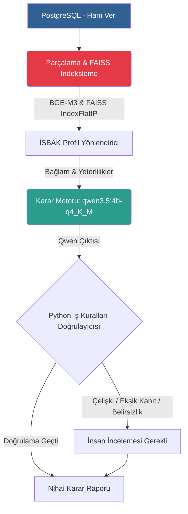

<div align="center">
  
  
  # EKAP İSBAK İhale Analiz Servisi
  
  **Yapay Zeka Destekli Uçtan Uca İKN Karar Motoru**

  [](https://www.python.org/downloads/)
  [](https://www.postgresql.org/)
  [](https://github.com/facebookresearch/faiss)
  [](https://ollama.ai/)
</div>

<br />

## 📖 İçindekiler
- [Projenin Amacı](#-projenin-amacı)
- [Mimari ve Akış](#-mimari-ve-akış)
- [Temel Özellikler](#-temel-özellikler)
- [Karar Sınıfları](#-karar-sınıfları)
- [Kurulum](#-kurulum)
- [Kullanım](#-kullanım)
- [Test ve Geliştirme](#-test-ve-geliştirme)
- [Klasör Yapısı](#-klasör-yapısı)
- [Sınırlamalar ve Notlar](#-sınırlamalar-ve-notlar)

---

## 🎯 Projenin Amacı

Bu proje, Türkiye Cumhuriyeti Elektronik Kamu Alımları Platformu (EKAP) üzerinde yayınlanan ihalelerin **İstanbul Bilişim ve Akıllı Kent Teknolojileri A.Ş. (İSBAK)** çalışma alanlarına ve yeterliliklerine uygunluğunu analiz eden yapay zeka (LLM) destekli bir karar motorudur. 

Sistem; ihale şartnamelerini, ilanları ve idari gereksinimleri okuyarak **Anlamsal Arama (FAISS)** yöntemiyle güncel aktif ihaleleri tarar ve toplar. Aynı ihale farklı profillerden gelirse tek kayıt altında birleştirilir. Ardından **Qwen** modeli faaliyet uygunluğu kararı üretir; Python iş kuralları negatif kapsamı ve kanıt bütünlüğünü doğrular. Katılım yeterliliği faaliyet kararından ayrı raporlanır.

---

## 🏗️ Mimari ve Akış

Sistem, yapay zeka halüsinasyonlarını (uydurmalarını) en aza indirmek ve kurumsal iş kurallarına tam uyum sağlamak için "Çok Katmanlı Yönlendirme ve Doğrulama" mimarisini kullanır.



**İnsan İncelemesine Yönlendirme Durumları (Çelişki / Eksik Kanıt / Belirsizlik) Nasıl Oluşur?**
- **Çelişki:** Birincil model ihaleyi "uygun" bulsa da, Python İş Kuralları katmanının zorunlu bir kriter ihlali (örneğin donanım ihalesinde sadece yazılım profili getirilmesi) tespit etmesi.
- **Eksik Kanıt:** Birincil modelin kendi verdiği kararı destekleyecek geçerli bir metin parçası referansı (chunk_id) sunamaması veya sahte (olmayan) bir ID uydurması (halüsinasyon).
- **Belirsizlik:** İhale şartlarındaki bulanıklık nedeniyle modelin kararsız kalması veya güven skorunun düşük (düşük eminlik) olması.

### Akış Adımları:
1. **Veri Okuma Katmanı:** PostgreSQL'den ihaleye ait ham özellik, OKAS ve onay verilerini okur (Salt-Okunur).
2. **İndeksleme Katmanı:** Doğal veritabanı yapısı korunarak (Özet, Kapsam, Karakteristikler vb.) bölüm farkındalıklı parçalama yapılır ve `BAAI/bge-m3` modeliyle vektörize edilerek atomik şekilde **FAISS** indeksine yazılır.
3. **Profil Arama (Retrieval):** İSBAK profilleri (YAZILIM, DONANIM, ARGE vb.) üzerinden FAISS'te anlamsal arama yapılarak ilgili aday ihaleler bulunur.
4. **Karar Motoru (qwen3.5:4b-q4_K_M):** İlgili profildeki kurumsal yeterliliklerin, ihalenin şartlarını karşılayıp karşılamadığını değerlendirir.
5. **Python Kural Doğrulayıcısı (IsbakDeterministicValidator):** Model kararını geçerli parça kimlikleriyle denetler; negatif profil terimlerini ihale başlığı, OKAS kodları ve gerçek kanıt parçaları üzerinden bağımsız olarak doğrular.
6. **Güven Kalibrasyonu:** Modelin ham güven puanı; kanıt sayısı, kullanılan kanıtlar, faaliyet eşleşmesi, aday getirme puanı ve doğrulama sorunlarına göre yalnızca aşağı yönlü sınırlandırılır.
7. **Faaliyet–Katılım Ayrımı:** Nihai etiket faaliyet kapsamını gösterir. Belge, personel ve iş deneyimi gibi doğrulanamayan katılım şartları ayrı alanlarda tutulur ve tek başına faaliyet kararını değiştirmez.
8. **İnsan İncelemesi:** Qwen kararsız kaldığında veya Python doğrulaması kritik sorun bulduğunda karar `inceleme_gerekli` olur.
9. **Raporlama:** Profil–ihale adayları, benzersiz ihale adayları, kararlar ve insan inceleme kayıtları ayrı **JSONL/CSV** çıktılarında saklanır.

---

## ✨ Temel Özellikler

- **Bölüm Farkındalıklı Parçalama:** Veritabanındaki mantıksal sütun ayrımları (kapsam, teknik özellik, OKAS) tek bir metin bloğuna sıkıştırılmaz; doğal formlarında parçalanır.
- **FAISS Vektör Arama:** Milyonlarca parçayı milisaniyeler içerisinde anlamsal olarak tarayabilen lokal, bellek-içi (in-memory) L2-normalize edilmiş `IndexFlatIP` vektör mimarisi.
- **Deterministik Önbellekleme:** Gereksiz LLM (Embedding) maliyetini önlemek için `source_hash` takibi yapılarak sadece değişen ihaleler yeniden vektörleştirilir.
- **Python Guardrails:** Yapay zekanın "Blackbox" kararlarını Python katmanında deterministik iş kuralları ile ezer ve yönlendirir.
- **Benzersiz İhale Birleştirmesi:** Aynı İKN'nin farklı profillerdeki eşleşmeleri tek model çağrısında birincil ve destekleyici profiller olarak birleştirilir.
- **Kaynak Tabanlı Negatif Kapsam:** Modelin negatif kapsam beyanı gerçek ihale başlığı ve kanıt parçalarında doğrulanmadan kesin kabul edilmez; OKAS desteği ayrıca kaydedilir.
- **Şeffaf Güven Kalibrasyonu:** Ham model güveni, uygulanan üst sınır ve gerekçeleri raporda ayrı alanlar olarak sunulur.
- **İSBAK İzolasyonu:** İSBAK A.Ş. tarafından açılan kurum-içi ihaleler vektörizasyon öncesinde otomatik olarak dışlanır.

---

## 📊 Nihai Aday Puanı Hesaplaması

Aday ihalelerin uygunluk derecesi, anlamsal arama sonuçlarından elde edilen çeşitli metriklerin ağırlıklandırılmasıyla hesaplanır. Puanlama formülü şu şekildedir:

**Nihai Puan =** 
  `(0.55 × En Yüksek Parça Skoru)` + 
  `(0.20 × En İyi Parçaların Ortalama Skoru)` + 
  `(0.10 × Bölüm Çeşitlilik Skoru)` + 
  `(0.10 × OKAS Destek Skoru)` + 
  `(0.05 × Başlık Destek Skoru)`

**Kavramların Açıklaması:**
- **En Yüksek Parça Skoru:** İhale metninde, profille anlamsal olarak en yüksek benzerliği (FAISS skoru) gösteren tekil bölümün puanı.
- **En İyi Parçaların Ortalama Skoru:** İhaleye ait eşleşen en yüksek puanlı bölümlerin ortalaması (ihaleye ait bağlamın ne kadar tutarlı olduğunu ölçer).
- **Bölüm Çeşitlilik Skoru:** Eşleşen kısımların, ihale dokümanında ne kadar farklı alanlardan (ör. kapsam, teknik şartname, idari gereksinimler) geldiğini ödüllendiren metrik.
- **OKAS Destek Skoru:** İhalenin OKAS (Ortak Kamu Alımları Sözlüğü) kodlarının, profildeki anahtar kelimelerle örtüşme oranı.
- **Başlık Destek Skoru:** İhale başlığının, profildeki anahtar kelimelerle kelime bazlı örtüşme oranı.

Elde edilen nihai puandan, ihale ile kurumsal profil arasında bir uyumsuzluk tespit edilirse (negatif yönlendirme) **0.10** oranında bir **Profil Uyuşmazlığı Cezası** düşülür. 

Nihai Puan hesaplandıktan sonra, eğer puan `0.35` (minimum eşik) altında ise ihale aday havuzuna (LLM değerlendirmesine) alınmaz.

---

## ⚖️ Karar Sınıfları

Sistem, analiz sonucunda aşağıdaki 3 nihai durumdan birini döndürür:

| Karar | Açıklama |
| :--- | :--- |
| 🟢 **uygun** | İhale faaliyet konusu, seçilen İSBAK profilinin ürün/hizmet kapsamıyla kanıtlı biçimde örtüşmektedir. Katılım yeterliliği ayrı kontrol edilir. |
| 🔴 **uygun_degil** | İhale faaliyet konusu seçilen profilin kapsamı dışındadır veya doğrulanmış negatif kapsamla çelişmektedir. |
| 🟡 **inceleme_gerekli** | Faaliyet kapsamı belirsizdir ya da model kararı ile Python doğrulaması arasında kritik bir çelişki vardır. |

---

## 🚀 Kurulum

### Ön Koşullar
- Python 3.11 veya üzeri
- PostgreSQL Veritabanı (Mevcut EKAP verisinin bulunduğu sunucu)
- Ollama (Qwen modelinin yüklü olduğu LLM sunucusu)

### 1. Depoyu Klonlayın
```bash
git clone https://github.com/KeremUUnal/EkapLLM.git
cd EkapLLM
```

### 2. Sanal Ortam Oluşturun ve Bağımlılıkları Yükleyin
```bash
python -m venv .venv
source .venv/bin/activate  # Windows için: .venv\Scripts\activate
pip install -e ".[dev]"
```

### 3. Çevre Değişkenlerini Ayarlayın
`.env.example` dosyasını kopyalayarak `.env` oluşturun:
```bash
cp .env.example .env
```
`.env` dosyanızı kendi ortamınıza (PostgreSQL ve Ollama host bilgileri) göre düzenleyin. 

---

## 💻 Kullanım

## 2. PostgreSQL to FAISS İndeksleme (Aktif İhaleler)

Ekap ihalelerinin güncel aktif listesi PostgreSQL'den okunarak `BGE-M3` modelinden geçirilir ve **FAISS** indeksine aktarılır. `SectionAwareChunker` ile parçalanan ihale verileri `faiss-cpu` kullanılarak depolanır. İndeksleme süreci durumları (processing, indexed, vb.) PostgreSQL'deki `software_tender_index_state` tablosu üzerinde tutulmaktadır.

Kullanımı:
```bash
python scripts/build_active_tenders_faiss.py --recreate
```

## 3. Kurulum ve Çalıştırmaur:
```bash
python scripts/build_active_tenders_faiss.py
```

### 2. Aday İhaleleri Test Etme
Oluşturulan FAISS indeksini kullanarak profil bazlı arama testi yapar:
```bash
python scripts/test_faiss_retrieval.py
```

### 3. Model Karar Zincirini Çalıştırma
Aday ihaleleri LLM doğrulama zincirine sokarak nihai uygunluk kararlarını üretir:
```bash
python scripts/run_tender_decision_chain.py
```

`--max-decisions` benzersiz ihale kararlarını sınırlar; aynı İKN farklı profillerde görünse bile bir kez modele gönderilir.

### Rapor Çıktıları
Analiz tamamlandığında `reports/` klasörü altında şu temel çıktılar oluşur:

- `profile_tender_candidates.jsonl`: profil bazlı ham aday satırları,
- `unique_tender_candidates.jsonl`: birleştirilmiş benzersiz ihale adayları,
- `tender_model_decisions.jsonl/csv`: tek ihale başına nihai karar,
- `tender_review_required.csv`: yalnızca gerçek insan incelemesi gereken kararlar.

---

## 🧪 Test ve Geliştirme

Kod kalitesini ve iş kurallarını test etmek için:

**Uçtan Uca (E2E) ve Birim (Unit) Testleri:**
*(Tüm testler FAISS mock'laması ve veritabanı yalıtımı ile çalışır)*
```bash
PYTHONPATH=. pytest -q tests/unit/
```

**Linter ve Tip Kontrolleri (Ruff & Mypy):**
```bash
ruff check app scripts tests
mypy app scripts tests
```

---

## 📂 Klasör Yapısı

```text
ekap_rag_3model/
├── app/
│   ├── config/              # .env ve ayar yapılandırmaları
│   ├── database/            # PostgreSQL repository sınıfları
│   ├── decision/            # LLM Karar modelleri ve Python Doğrulayıcısı
│   ├── indexing/            # Parçalama ve Hash üreteçleri
│   ├── pipeline/            # Ana analiz akışını yöneten servisler
│   ├── profiles/            # İSBAK Şirket Profil yöneticileri
│   ├── reporting/           # JSON ve CSV rapor çıktı üreticileri
│   ├── retrieval/           # RAG ve Profil Router yöneticileri
│   └── vector_store/        # FAISS index ve önbellek yöneticileri
├── scripts/
│   ├── audit_chunking.py                # Parçalama denetim aracı
│   ├── audit_postgresql_tenders.py      # PostgreSQL veri şeması analiz aracı
│   ├── build_active_tenders_faiss.py    # İhaleleri vektörize eden ana betik
│   ├── run_tender_decision_chain.py     # LLM karar zincirini çalıştıran betik
│   └── test_faiss_retrieval.py          # Arama algoritmalarını test eden betik
├── tests/
│   └── unit/                # Bağımsız iş mantığı (birim) testleri
├── docs/                    # Mimari belgeler (POSTGRESQL_AKTIF_IHALE_FAISS_MIMARISI.md vb.)
├── reports/                 # Analiz çıktı dizini
├── .env                     # Ortam değişkenleri
└── pyproject.toml           # Proje bağımlılıkları ve meta bilgileri
```

---

## ⚠️ Sınırlamalar ve Notlar

- **Ollama Bağımlılığı:** Qwen (`qwen3.5:4b-q4_K_M`) modelinin ilgili Ollama sunucusunda kurulu ve çalışır durumda olması zorunludur.
- **Donanım İhtiyacı:** Sistem tamamen RAM (CPU) üzerinde çalışacak şekilde yapılandırılmıştır. Ekran kartı (GPU) kullanımı tamamen devredışı bırakılmıştır (`EMBEDDING_DEVICE=cpu`). BGE-M3 gömme modelinin çalışabilmesi için yeterli miktarda sistem belleğine (RAM) ihtiyaç vardır.
- **Ağ İhtiyacı:** Güncel verilerin alınması için PostgreSQL sunucusuna erişim zorunludur (Testler hariç). Qdrant bağımlılığı kaldırılmış olup yalnızca FAISS kullanılmaktadır.
