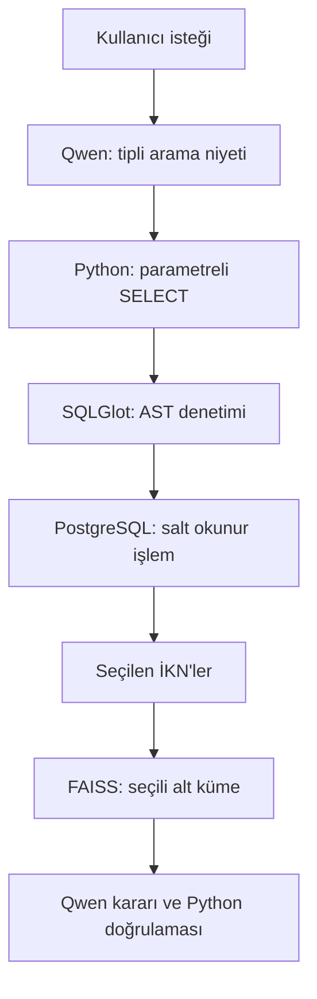

# EKAP–İSBAK SQL Encoder V1

## 1. Amaç

SQL Encoder (SQL kodlayıcı), kullanıcının doğal dildeki ihale seçme isteğini PostgreSQL üzerinde güvenli ve salt okunur bir sorguya dönüştürür. Seçilen İKN'ler mevcut BGE-M3 → FAISS → Qwen → Python doğrulama hattına doğrudan aktarılır.

Qwen `qwen3.5:4b-q4_K_M` tek üretken modeldir. İlk aşamada yalnız tipli arama niyeti, ikinci aşamada ihale kararı üretir. Model serbest SQL yazmaz.

## 2. Mimari



Doğal dil isteği `app/sql_encoder/selection.py` tarafından doğrudan `SqlEncoderService` servisine iletilir. Ayrı sunucu, istemci veya ağ taşıması bulunmaz.

## 3. Tipli arama niyeti

Qwen yalnız şu alanları doldurabilir:

- durum: `active`, `inactive`, `all`,
- sonuç sayısı,
- rastgele sıralama,
- il, ihale türü, idare, anahtar kelime,
- OKAS kodu ön eki,
- ihale başlangıç ve bitiş tarihi.

Python bu tipli niyeti sabit şablondan parametreli `SELECT` sorgusuna derler. Kullanıcı veya model metni SQL kodu olarak sorguya eklenmez.

`status="active"` için aşağıdaki iki koşul birlikte zorunludur:

```sql
t.ihale_durumu = ANY(%s::text[])
AND t.ihale_tarihi >= CURRENT_TIMESTAMP
```

## 4. Güvenlik sözleşmesi

Sistem hata durumunda kapalı kalır:

1. Yazma veya silme niyeti doğal dil aşamasında reddedilir.
2. Pydantic tip, uzunluk, tarih aralığı ve sonuç sınırını doğrular.
3. SQL yalnız sabit Python derleyicisinden ve parametreli olarak üretilir.
4. SQLGlot AST (soyut sözdizim ağacı) yalnız tek `SELECT` ifadesine izin verir.
5. Tablo, sütun ve işlev izin listesi uygulanır.
6. Yer tutucu ve parametre sayısı eşleşmesi doğrulanır.
7. Sorgu çalıştırılmadan hemen önce ikinci kez denetlenir.
8. PostgreSQL bağlantısı ve işlemi salt okunurdur.
9. Satır, sorgu süresi ve kilit bekleme süreleri sınırlıdır.

`INSERT`, `UPDATE`, `DELETE`, `DROP`, `ALTER`, `TRUNCATE`, `COPY`, çoklu ifade, CTE (ortak tablo ifadesi), `UNION`, `SELECT *`, yorum, pencere işlevi, kilitleme sorgusu ve izin dışı tablo/sütun reddedilir.

Üretim veritabanı kullanıcısı ayrıca yalnız `SELECT` yetkili bir PostgreSQL rolü olmalıdır.

## 5. Ayarlar

| Ayar | Varsayılan | Açıklama |
|---|---:|---|
| `SQL_ENCODER_MAX_ROWS` | 100 | En fazla sonuç satırı |
| `SQL_ENCODER_STATEMENT_TIMEOUT_MS` | 10000 | Sorgu zaman aşımı |
| `SQL_ENCODER_LOCK_TIMEOUT_MS` | 1000 | Kilit bekleme zaman aşımı |
| `SQL_ENCODER_MAX_SQL_CHARS` | 12000 | SQL metni uzunluk sınırı |
| `SQL_ENCODER_MAX_JOINS` | 3 | En fazla `JOIN` (birleştirme) sayısı |
| `SQL_ENCODER_MAX_AST_NODES` | 500 | Sorgu karmaşıklık sınırı |
| `SQL_ENCODER_MAX_REQUEST_CHARS` | 2000 | Doğal dil isteği uzunluk sınırı |
| `SQL_ENCODER_TIMEOUT_SECONDS` | 180 | Qwen niyet çıkarma zaman aşımı |
| `SQL_ENCODER_NUM_CTX` | 4096 | Niyet istemi bağlam sınırı |
| `SQL_ENCODER_NUM_PREDICT` | 300 | Niyet çıktısı token (metin birimi) sınırı |
| `SQL_ENCODER_DEFAULT_RANDOM_SEED` | 20260806 | Yeniden üretilebilir rastgele seçim tohumu |

Ayrı ayar örneği: `config/sql_encoder.env.example`.

## 6. Çalıştırma

Yalnız SQL Encoder seçimini doğrulamak için:

```bash
PYTHONPATH=. python -u scripts/check_sql_encoder.py \
  --request "Aktif durumdaki 5 rastgele ihaleyi getir." \
  --random-seed 20260806
```

Seçilen ihaleleri mevcut karar hattına aktarmak için:

```bash
RUN_TIME=$(date +%Y%m%d_%H%M%S)
PYTHONPATH=. python -u scripts/run_sql_encoder_tender_decision_chain.py \
  --request "Aktif durumdaki 5 rastgele ihaleyi getir." \
  --selection-random-seed 20260806 \
  --report-dir "reports/sql_encoder_full_${RUN_TIME}" \
  -- --log-level INFO
```

Qwen kararını çalıştırmadan PostgreSQL → SQL Encoder → FAISS aktarımını doğrulamak için son komuta `-- --retrieval-only --log-level INFO` ekleyin.

## 7. Raporlar

- `sql_encoder_selection.json`: doğal dil isteği, model, parametreli SQL, parametreler ve seçilen İKN'ler,
- `sql_encoder_selection_coverage.json`: seçilen İKN'lerin FAISS kapsamı,
- mevcut karar hattının JSONL/CSV karar ve insan işlem kuyruğu raporları.

Raporlara parola, bağlantı dizgesi veya veritabanı kullanıcı kimliği yazılmaz.

## 8. Testler

```bash
python -m compileall -q app scripts tests
ruff check app scripts tests
mypy --follow-imports silent app/sql_encoder

PYTHONPATH=. pytest -q \
  tests/unit/test_sql_encoder_validator.py \
  tests/unit/test_sql_encoder_compiler.py \
  tests/unit/test_sql_encoder.py \
  tests/unit/test_sql_encoder_executor.py \
  tests/unit/test_sql_encoder_selection.py \
  tests/unit/test_faiss_subset_search.py

PYTHONPATH=. pytest -q -m external \
  tests/integration/test_sql_encoder_database.py
```

## 9. Kabul kontrolleri

- Aynı istek ve aynı tohum aynı İKN sırasını üretmelidir.
- Şehir, anahtar kelime ve diğer değerler SQL metnine yapışmamalı; `parameters` içinde olmalıdır.
- `"Tüm ihaleleri sil"` isteği SQL çalıştırılmadan reddedilmelidir.
- Seçili her İKN FAISS'te bulunmalı; eksik kapsam karar zincirini durdurmalıdır.
- Aynı İKN en fazla bir kez Qwen kararına gitmelidir.
- Qwen dışında ikinci karar modeli yüklenmemelidir.
